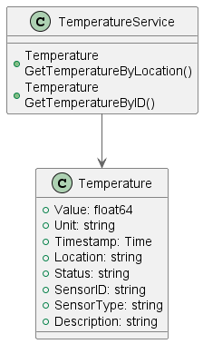

# Project_template

Это шаблон для решения проектной работы. Структура этого файла повторяет структуру заданий. Заполняйте его по мере работы над решением.

# Задание 1. Анализ и планирование

<aside>

- Нынешнее приложение компании позволяет только управлять отоплением в доме и проверять температуру.
- Каждая установка сопровождается выездом специалиста по подключению системы отопления в доме к текущей версии системы.
- Архитектура приложения представляет из себя монолит на Go с СУБД Postgres. Всё синхронно. Никаких асинхронных вызовов, микросервисов и реактивного взаимодействия в системе нет. Всё управление идёт от сервера - к датчику. Данные о температуре также получаются через запрос от сервера к датчику.
- Самостоятельно подключить свой датчик к системе пользователь не может.

</aside

### 1. Описание функциональности монолитного приложения

**Управление отоплением:**

- Пользователи могут управлять отоплением в доме
- Система поддерживает изменение целевой температуры системе отопления

**Мониторинг температуры:**

- Пользователи могут просматривать текущую температуру в своих домах
- Система поддерживает запросы о показаниях температуры по названию локации и по Id датчика

### 2. Анализ архитектуры монолитного приложения

- Язык программирования: Go
- База данных: PostgreSQL
- Архитектура: Монолитная, все компоненты системы (обработка запросов, бизнес-логика, работа с данными) находятся в рамках одного приложения.
- Взаимодействие: Синхронное, запросы обрабатываются последовательно.
- Масштабируемость: Ограничена, так как монолит сложно масштабировать по частям.
- Развертывание: Требует остановки всего приложения.

### 3. Определение доменов и границы контекстов

Домен: 
* "Умные устройства".
* "Управление пользователями".
* "Тех. Поддержка".

Bounded Contexts:
* Контекст Device Management Service: Управление устройствами (датчики как устройства).
* Контекст: Телеметрия устройств (датчики как источники данных).
* Контекст: Система отопления (датчики как физические обьекты).

### **4. Проблемы монолитного решения**

- При добавлении новых типов датчиков придётся переписывать или добавлять новый код
- Невозможно масштабировать отдельные части приложения.
- Получение информации о датчиках (метод GetSensors) синхронное и время выполнения линейно зависит от количества установленных умных устройств у пользователя.

### 5. Визуализация контекста системы — диаграмма С4


# Задание 2. Проектирование микросервисной архитектуры

В этом задании вам нужно предоставить только диаграммы в модели C4. Мы не просим вас отдельно описывать получившиеся микросервисы и то, как вы определили взаимодействия между компонентами To-Be системы. Если вы правильно подготовите диаграммы C4, они и так это покажут.

**Диаграмма контейнеров (Containers)**


**Диаграмма компонентов (Components)**


Добавьте диаграмму для каждого из выделенных микросервисов.

**Диаграмма кода (Code)**



# Задание 3. Разработка ER-диаграммы

Добавьте сюда ER-диаграмму. Она должна отражать ключевые сущности системы, их атрибуты и тип связей между ними.


# Задание 4. Создание и документирование API

### 1. Тип API

- Гибкость, общеизвестный стандарт, простота интеграций а также легкое документирование и отладка фактические делают REST API выбором по умолчанию для взамодействия между сервисами на начальном этапе.

- Для взаимодейсвий не сильно требовательных к быстродействию можно использовать взаимодействие через брокер сообщений.

- С ростом проекта возможен переход на gRPC взаимодействия между микросервисами или комбинированный подход (REST + gRPC)

### 2. Документация API

Здесь приложите ссылки на документацию API для микросервисов, которые вы спроектировали в первой части проектной работы. Для документирования используйте Swagger/OpenAPI или AsyncAPI.

[Swagger Temperature API](./temperature_api/docs/swagger.json)
[Swagger Telemetry API](./telemetry_api/docs/swagger.json)
[Swagger Device manager API](./device_management_api/docs/swagger.json)

# Задание 5. Работа с docker и docker-compose

Перейдите в apps.

Там находится приложение-монолит для работы с датчиками температуры. В README.md описано как запустить решение.

Вам нужно:

1) сделать простое приложение temperature-api на любом удобном для вас языке программирования, которое при запросе /temperature?location= будет отдавать рандомное значение температуры.

Locations - название комнаты, sensorId - идентификатор названия комнаты

```
	// If no location is provided, use a default based on sensor ID
	if location == "" {
		switch sensorID {
		case "1":
			location = "Living Room"
		case "2":
			location = "Bedroom"
		case "3":
			location = "Kitchen"
		default:
			location = "Unknown"
		}
	}

	// If no sensor ID is provided, generate one based on location
	if sensorID == "" {
		switch location {
		case "Living Room":
			sensorID = "1"
		case "Bedroom":
			sensorID = "2"
		case "Kitchen":
			sensorID = "3"
		default:
			sensorID = "0"
		}
	}
```

2) Приложение следует упаковать в Docker и добавить в docker-compose. Порт по умолчанию должен быть 8081

3) Кроме того для smart_home приложения требуется база данных - добавьте в docker-compose файл настройки для запуска postgres с указанием скрипта инициализации ./smart_home/init.sql

Для проверки можно использовать Postman коллекцию smarthome-api.postman_collection.json и вызвать:

- Create Sensor
- Get All Sensors

Должно при каждом вызове отображаться разное значение температуры

Ревьюер будет проверять точно так же.


# **Задание 6. Разработка MVP**

Необходимо создать новые микросервисы и обеспечить их интеграции с существующим монолитом для плавного перехода к микросервисной архитектуре. 

### **Что нужно сделать**

1. Создайте новые микросервисы для управления телеметрией и устройствами (с простейшей логикой), которые будут интегрированы с существующим монолитным приложением. Каждый микросервис на своем ООП языке.
2. Обеспечьте взаимодействие между микросервисами и монолитом (при желании с помощью брокера сообщений), чтобы постепенно перенести функциональность из монолита в микросервисы. 

В результате у вас должны быть созданы Dockerfiles и docker-compose для запуска микросервисов. 

**Что я сделал**

**Telemetry API**
язык c# 
Сделал интеграцию для TemperatureAPI по AMQT (получаю телеметрию через брокера сообщений)
Сделал ручку для получения историчеких данных сенсора
TelemetryAPI переодически опрашивает не очень оптимизированный GetSensors из монолита. По моей изначальной задумке TelemetryAPI не должен инициировать сбор данных, а только принимать. Для этого нужно создать еще один сервис-сборщик либо добавить PUSH логику в Temperature API, но считаю что это выходит за замки задания

**Temperature API**
язык go 
Сделал интеграцию для Telemetry API по AMQT (отправляю телеметрию через брокера сообщений)

**Device management API**
язык go 
Сделал ручки, которые дублируют функционал управления сенсорами в монолите.
В будущем будет интегрирован в систему по паттерну Душитель через Gateway
Одна база с монолитом

**Smart Home (монололит)**
Сделал сервис-клиент management_service, который пробрасывает запросы с сенсорами в Device management API